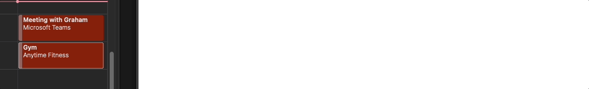
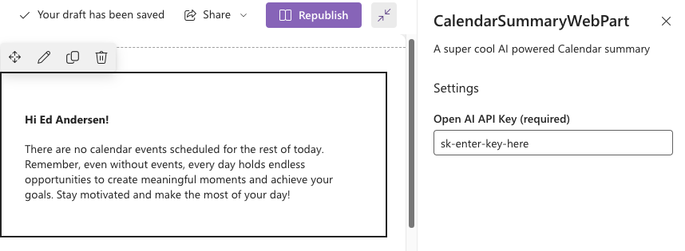

# Calendar Summary Sharepoint Framework Web Part Experiment

This is an experimental Sharepoint Framework (SPFx) web part that:

- Loads your Outlook calendar for the rest of the day
- Uses the OpenAI API to generate you a nice summary of your day
- Streams the result to the screen

The main logic for this code is in [this fiel](/src/webparts/calendarSummaryWebPart/components/CalendarSummaryWebPart.tsx)

Examples of the results:

Two events

One event

Empty calendar

## How to use / install

- Download the .sppkg file from the Releases page
- Upload to Sharepoint App catalog
- Add as a web part on a site
- On the Properties panel of the web part, add a valid OpenAI API key

## Potential improvements

Obviously removing the OpenAI dependency would be preferable here, but:

- Azure Open AI service is invite only at the moment
- Somehow call the Bing Copilot API for "chat" when a Microsoft 365 tenant has access to it. This would be the best as then the solution would not require an API key.

